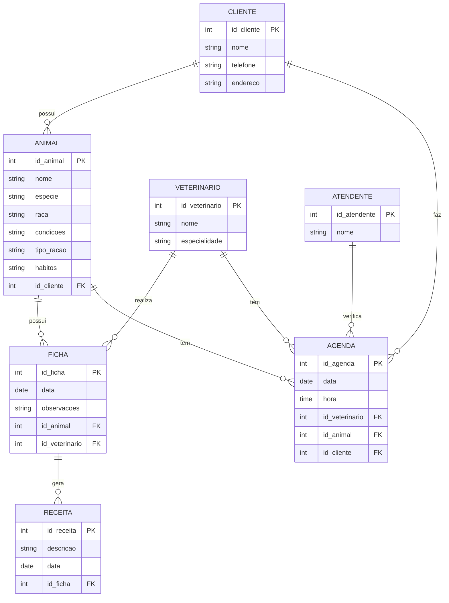

# -Pierre.neres
A.D.S

Autor= Pierre Neres Tomé

# 1. Descrição de sistema da clinica veterianaria

Sistema para clinica veterinaria

nome= Carinho de Pets

Exercício 1:

2: Uma clínica veterinária atende apenas os animais: gatos e cachorros. 
3: Os clientes devem fazer um cadastro de si e dos animais. 
4: Os clientes devem informar as condições nas quais os animais chegam. 
5: Os clientes devem informar o tipo de ração que o animal come. 
6: O cliente deve informar hábitos do animal. 
7: Para cada animal é possível que mais de um veterinário o atenda. 
8: Os animais podem chegar e serem atendidos de acordo com uma agenda do dia. 
9: Cada animal atendido receberá uma ficha e um prontuário. 
10: Outros dono podem querer marcar horários de atendimento futuro. 
11: O atendimento gera uma receita para o animal. 
12: Quando um cliente chega na clínica veterinária ele é atendido por um atendente. 
13: O atendente deve verificar se existe agenda disponível com um veterinário. 
14: O atendente deve colocar o cliente e seu animal na fila de espera, se for o caso. 
15: O atendente deve levar o cliente e o animal até o veterinário. 
16: O veterinário deve realizar uma entrevista com o dono do animal. 
17: O resultado da entrevista deve ir para um formulário. 
18: O veterinário deverá examinar o animal e anotar em prontuário(ficha) suas observações. 
19: Dependendo da situação do animal este receberá uma receita.
20: O veterinário deve realizar o operação em animais feridos.
21: O atendemos até um certo horário da noite.
22: Trabalhamos com aminas de rua.
23: Trabalhamos com atendimento com domicilio.  
24: Trabalhamos com vários tipo de animais.
25: Planos de saúde com seu pets.
26: Também temos uma versão primem para seu pets. 

----
# 2. Diagrama do banco de dados





----
# 3. Diagrama de caso de uso


----
# 4. Principais telas do sistema 


---
# 5.Arquitetura de sistema


```graph TD;

    %% Definição de Contêineres
    subgraph WebClient [Cliente Web]
        Browser[Browser]
    end
    
    subgraph MobileClient [Cliente Mobile]
        MobileApp[Aplicativo Mobile]
    end
    
    subgraph GHPC [Aplicação GHP]
        WebApp[Aplicação Web]
    end
    
    subgraph API [API REST]
        VeterinarioAPI[API Veterinários]
        ClienteAPI[API Clientes]
        AgendamentoAPI[API Agendamento]
        AtendimentoAPI[API Atendimento]
    end
    
    subgraph Database [Servidor de Banco de Dados]
        ClientesDB[(Clientes DB)]
        AnimaisDB[(Animais DB)]
        AgendamentosDB[(Agendamentos DB)]
        FichasDB[(Fichas e Prontuários DB)]
    end
    
    %% Definição de Fluxos de Informação
    Browser --> |HTTP Request| WebApp
    MobileApp --> |API Request| VeterinarioAPI
    
    WebApp --> |Consulta| VeterinarioAPI
    WebApp --> |Consulta| ClienteAPI
    WebApp --> |Consulta| AgendamentoAPI
    WebApp --> |Consulta| AtendimentoAPI
    
    VeterinarioAPI --> |Consulta/Atualização| ClientesDB
    ClienteAPI --> |Consulta/Atualização| ClientesDB
    AgendamentoAPI --> |Consulta/Atualização| AgendamentosDB
    AtendimentoAPI --> |Consulta/Atualização| FichasDB
    
    VeterinarioAPI --> |Consulta| AnimaisDB
    ClienteAPI --> |Consulta| AnimaisDB
    
    VeterinarioAPI --> |Atualização| FichasDB

```
